# 👋 Hi, I’m [Tyson Shannon](https://tysonshannon.ca/) 

  

  

## Who am I?
I'm a Canadian computer information technology student at MNSU Mankato **(graduating May 2026)** with a focus in software development and cyber security  

## What am I doing?
I'm currently teaching myself TypeScript, React, and Web3.0 technologies through my projects [UNet](https://github.com/Tyson-Shannon/UNet) and [TNet](https://github.com/Tyson-Shannon/TNet)  

## What am I learning?
I'm currently learning intro to networking, database management systems, software quality assurance and testing, web application design and development, human computer interaction, information warfare, advanced object oriented programming, and computers in society at MNSU  

## What I know?

<table>
  <thead>
    <tr>
      <th><strong>My Code Stack Includes:</strong></th>
      <th><strong>My Tech Stack Includes:</strong></th>
    </tr>
  </thead>
  <tbody>
    <tr>
      <td>Python</td>
      <td>TensorFlow</td>
    </tr>
    <tr>
      <td>Java</td>
      <td>GitHub</td>
    </tr>
    <tr>
      <td>C/C++</td>
      <td>Linux</td>
    </tr>
    <tr>
      <td>Ruby</td>
      <td>VirtualBox</td>
    </tr>
    <tr>
      <td>Go</td>
      <td>VS Code</td>
    </tr>
    <tr>
      <td>R</td>
      <td>RStudio</td>
    </tr>
    <tr>
      <td>SQL</td>
      <td>MySQL</td>
    </tr>
  </tbody>
</table>
<strong>+ much more</strong>

## How am I contacted?
**Location:** Greater Toronto Area, Ontario, Canada, North America, Earth, Milky Way Galaxy, Universe  
**Public Contact:** tyshannon.dev@outlook.com  
**Social Media:** [LinkedIn](https://www.linkedin.com/in/tyson-shannon-a56458276/)  

<!---
Tyson-Shannon/Tyson-Shannon is a ✨ special ✨ repository because its `README.md` (this file) appears on your GitHub profile.
You can click the Preview link to take a look at your changes.
--->
